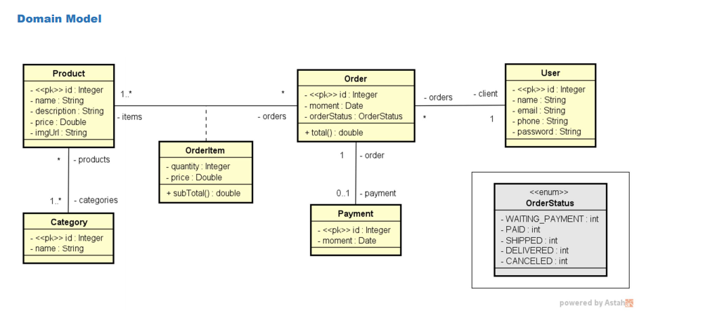
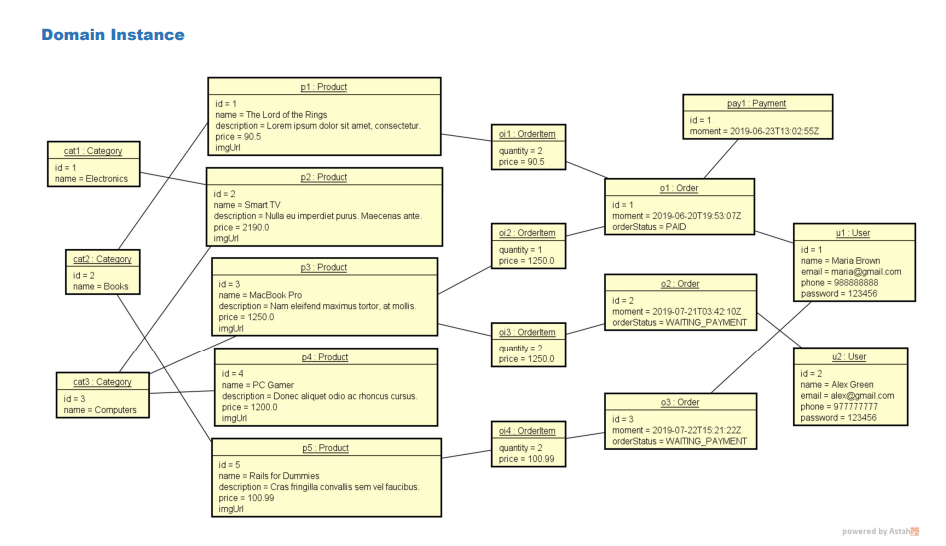
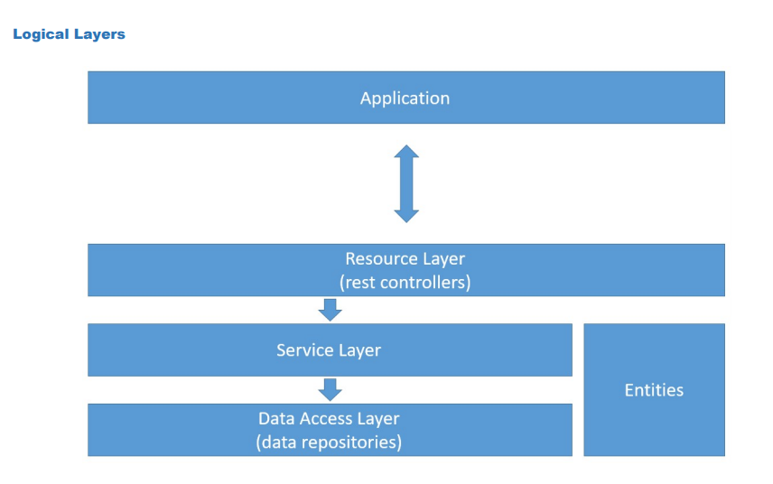

# webservices-springboot-jpa
Projeto web services com Spring Boot e JPA / Hibernate realizado no curso Java COMPLETO da Udemy

## Aplicação Web a desenvolver
Projeto web services com Spring Boot e JPA / Hibernate 

### Ambiente Tecnologico
Spring Tool Suite 4, Java, Maven, Apache Tomcat, Database H2, Postman, Heroku, PostgreSQL

### Objetivos
- Criar projeto Spring Boot Java
- Implementar modelo de domínio
- Estruturar camadas lógicas: resource, service, repository
- Configurar banco de dados de teste (H2)
- Povoar o banco de dados
- CRUD 
  - Create
  - Retrieve 
  - Update 
  - Delete
- Tratamento de exceções
- Deploy projecto Spring Boot JPA com:
  - Heroku
  - PostgreSQL

